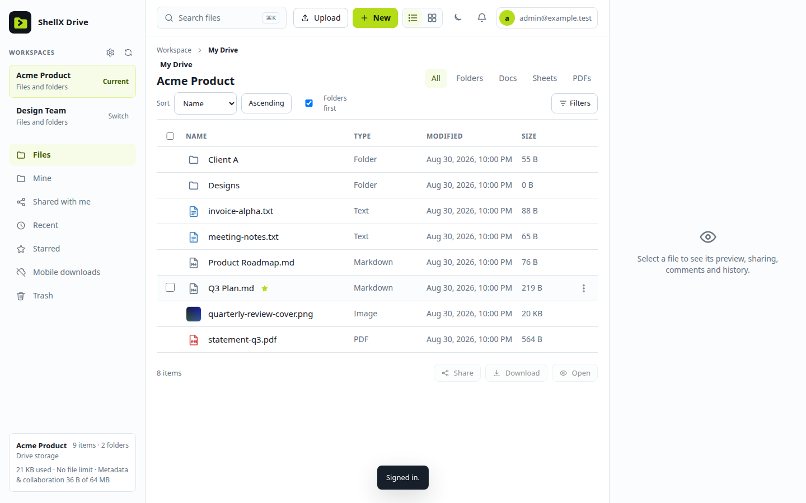
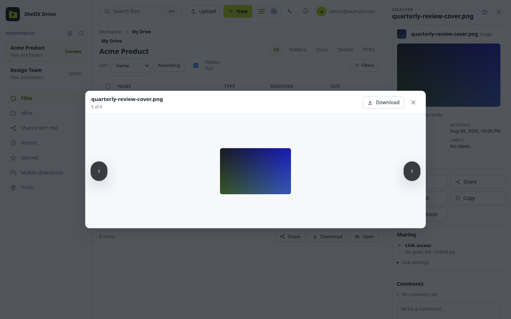
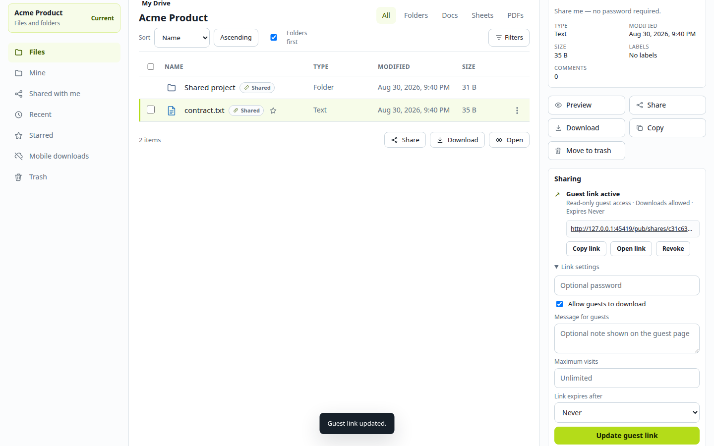
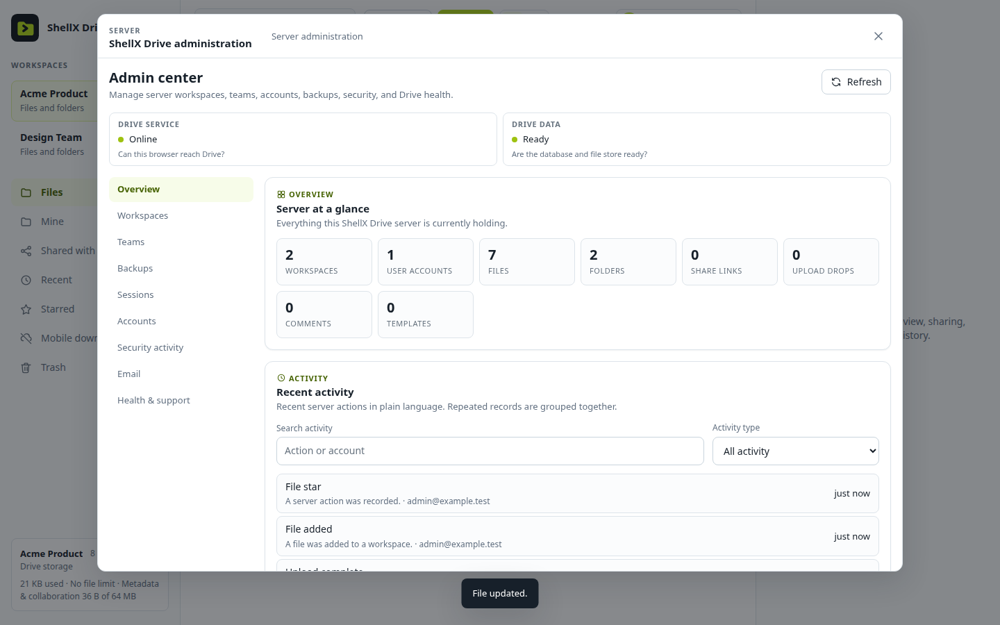

# ShellX Drive

[](https://github.com/martinsbrezauckis/shellx-drive/actions/workflows/ci.yml)
[](Cargo.toml)
[](LICENSE)

A self-hosted cloud drive in one Rust binary, with workspaces, sharing,
previews, versioning, backups, WebDAV, and desktop sync.



ShellX Drive is built for a person, team, or organization that wants a capable
Drive service with storage under its control. The server embeds
its web app, stores metadata in SQLite and file bodies in a local data directory,
and binds to loopback by default. Put the single binary behind the HTTPS reverse
proxy you already trust.

It is part of the [ShellX](https://theshellx.com) tool family and runs
independently of other ShellX products.

## Highlights

- **Files that behave like a drive:** folders, previews, search, labels, stars,
  comments, folder sizes, trash, revisions, conflict copies, batch actions, and
  resumable uploads up to 2 GiB.
- **Controlled sharing:** account and group Viewer/Editor access, read-only
  guest links for a file or folder, optional passwords, expiry or **Never**,
  visit limits, download policy, revocation, guest messages, and separate upload
  drops.
- **Useful on every screen:** a responsive web app, an installable PWA with
  mobile metadata browsing, explicit mobile downloads, camera upload, and
  notifications.
- **Open clients and protocols:** desktop sync applications for Windows, macOS,
  and Linux, fixed-size delta sync, nested WebDAV, an office provider bridge,
  and a small Google Drive API subset for adapters.
- **Operations included:** streaming `.sxdbackup` v2 backups, validation and
  restore, retention policy, storage usage, security activity, session control,
  readiness checks, and a redacted support bundle.
- **Agent-native:** the same authenticated HTTP API powers the web app, clients,
  tests, and automation. A bundled [agent skill](skill/shellx-drive/SKILL.md)
  documents safe end-to-end operation.

## Screenshots

| Preview files without downloading | Configure a guest link in place |
| --- | --- |
|  |  |

### Server administration



<sub>Screenshots were captured from a disposable local instance with synthetic
files and an `example.test` account.</sub>

## Install

### Release package

The supported production path is a release archive built and attested by this
repository. Start with the [first-install guide](docs/public/FIRST_INSTALL.md):
it covers host preflight, package verification, the hardened systemd service,
your existing TLS proxy, and first-administrator creation.

The installer creates a private service account, a root-owned configuration,
and independent random operator and bootstrap tokens. Drive binds to
`127.0.0.1:5758` by default. First-admin creation requires the setup token generated
on the server and closes after the first account exists.

### Build and run locally

```bash
git clone https://github.com/martinsbrezauckis/shellx-drive.git
cd shellx-drive
cargo build --locked --release --bin shellx-drive

export SHELLX_DRIVE_TOKEN="$(openssl rand -hex 32)"
export SHELLX_DRIVE_BOOTSTRAP_TOKEN="$(openssl rand -hex 32)"
./target/release/shellx-drive \
  --bind 127.0.0.1:5758 \
  --data-dir .shellx-drive-data
```

Open `http://127.0.0.1:5758`, enter the bootstrap token, and create the first
administrator. Use this source-build path for local evaluation and development,
with the listener on loopback. Choose an authenticated release package for
production and route HTTPS through a trusted reverse proxy.

For a persistent service, use the authenticated package procedure in
[packaging/README.md](packaging/README.md). Run its privileged installer from the
verified root-private package stage.

## How storage and access work

Drive file bodies are **server-readable by design**. That enables previews,
indexing, WebDAV, sharing, export, and office-editor handoff. For payloads you
want to keep confidential from the host, encrypt them locally before upload
and store the resulting ciphertext in Drive.

Normal sessions enter workspace owner/editor/viewer checks. User API requests
send the user's current session or account-wide delegated credential:

```text
Authorization: Bearer <current-user-session-or-account-wide-delegation>
```

The optional `x-shellx-actor` header is reserved for trusted operator-controlled
requests. Normal user authentication uses the user's credential above. The
server operator token is a powerful administrative credential. Anyone who holds
it can act as the local administrator. Generate it randomly and keep its value
confined to the protected service configuration and authenticated requests.
See [SECURITY.md](SECURITY.md) for the complete model and vulnerability-reporting
process.

## Capability map

| Area | Included in v0.1.1 |
| --- | --- |
| Files | Create, upload, download, copy, move, rename, search, metadata, folder covers, previews, batch ZIP download, trash, and revision history |
| Collaboration | Workspaces, roles, invitations, groups, comments, guest shares, guest upload drops, visit/download accounting, and per-workspace policies |
| Sync | Desktop sync reference engine and native clients for Windows x86-64, macOS arm64, and Linux x86-64 with the required desktop runtime APIs; mobile metadata sync, offline marks, resumable upload, fixed-size delta sync, and conflict copies |
| Interoperability | Nested WebDAV, office provider handoff, bounded legacy text import/export, and a Google Drive API subset |
| Identity | Local password accounts, TOTP 2FA, recovery codes, revocable sessions, browser/IP security history, and an optional trusted identity bridge |
| Operations | Readiness, streaming v2 backup/validate/restore, retention cleanup, quotas, activity logs, email outbox status, and support bundles |
| Automation | API-first operation, an agent skill, and a token-protected Debug API that stays out of the ordinary user interface |
| Hosted mode | Optional administrator-provisioned tenant layer with hosted-readiness metadata and a hosted readiness endpoint; administrators provision tenant access |

Install and configure desktop sync using the
[Windows](docs/public/WINDOWS_DESKTOP.md),
[macOS](docs/public/MACOS_DESKTOP.md), or
[Linux](docs/public/LINUX_DESKTOP.md) guide.

## Configuration

The most important production settings are:

| Setting | Purpose |
| --- | --- |
| `SHELLX_DRIVE_TOKEN` | Strong operator/API credential; required outside tests |
| `SHELLX_DRIVE_BOOTSTRAP_TOKEN` | Independent one-time authority for first-admin creation |
| `SHELLX_DRIVE_PUBLIC_ORIGIN` | Final public HTTPS origin used consistently for browser checks, hosted status, and links |
| `--bind` | Listener address; production default should remain loopback |
| `--data-dir` | Persistent SQLite, blobs, backup metadata, and service state |

See [CONFIG.md](docs/public/CONFIG.md) for every flag and environment variable,
and [OPERATIONS.md](docs/public/OPERATIONS.md) for TLS, backup, restore, upgrade,
and recovery procedures.

## Release checks

Public CI checks formatting, server and desktop-core compilation and linting,
dependency audits, retained compatibility-backport source, and SBOM generation
and scanning. Feature, browser, end-to-end, and installed-client qualification
is maintained separately with private test tooling and fixtures.

The retained compatibility-backport verifiers require Python 3.11+. On Ubuntu,
desktop-core compilation requires `pkg-config` and `libglib2.0-dev`.
Useful public source checks are:

```bash
cargo fmt --check
cargo check --locked --lib --bins
cargo clippy --locked --lib --bins -- -D warnings
python3 scripts/verify_glib_backport.py
python3 scripts/verify_tauri_updater_macos_backport.py
(cd desktop && pnpm install --frozen-lockfile --ignore-scripts) # Node >=22 / pnpm >=10
(cd desktop && pnpm audit --audit-level high)
./scripts/sbom.sh --out target/sbom
cargo build --locked --release --bin shellx-drive
```

Compatible dependency ranges allow updates; the lockfiles retain reproducible
resolutions. Newer stable Node, pnpm, and Rust toolchains are accepted, subject
to the declared minimums and passing checks. Validate dependency updates
through the relevant build, lint, and audit checks.

The repository owner can manually dispatch the release-candidate workflow on
`main` in `martinsbrezauckis/shellx-drive`. It binds the package, checksums,
CycloneDX SBOM, provenance, and GitHub artifact attestation to the exact public
source revision. Its successful result records build and package verification;
feature and installed-client qualification remains separate.

## Documentation

| Document | Purpose |
| --- | --- |
| [First install](docs/public/FIRST_INSTALL.md) | Safe package admission, host preflight, TLS routing, and first administrator |
| [Operations](docs/public/OPERATIONS.md) | Reverse proxy, backup/restore, upgrades, and recovery |
| [Configuration](docs/public/CONFIG.md) | CLI flags and `SHELLX_DRIVE_*` environment variables |
| [API](docs/public/API.md) | Authenticated and public HTTP route catalog |
| [Architecture](docs/public/ARCHITECTURE.md) | Storage, workspace, sync, conflict, and service boundaries |
| [Windows desktop](docs/public/WINDOWS_DESKTOP.md) | Installer verification, one connection, managed roots, status, and recovery |
| [macOS desktop](docs/public/MACOS_DESKTOP.md) | Installation, one connection, managed roots, and recovery |
| [Linux desktop](docs/public/LINUX_DESKTOP.md) | Installation, one connection, managed roots, and recovery |
| [Support and compatibility](docs/public/SUPPORT_AND_COMPATIBILITY.md) | Supported features, preview formats, runtime requirements, and safe issue reporting |
| [Third-party notices](NOTICE) | Project Nayuki QR Code generator attribution and regeneration record |
| [Debug API](docs/public/DEBUG_API.md) | Agent/test surface and redaction contract |
| [Agent skill](skill/shellx-drive/SKILL.md) | Safe headless workflows and endpoint reference |
| [Changelog](CHANGELOG.md) | Release history |

## License

Created by Martins Brezauckis.

MIT — see [LICENSE](LICENSE). © 2026 Martins Brezauckis.
